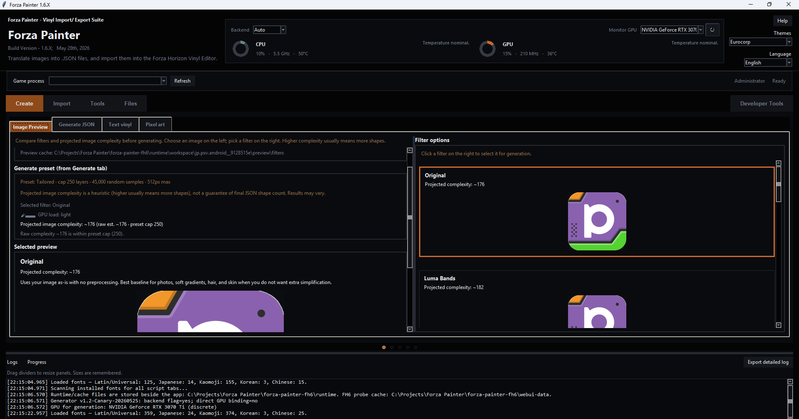
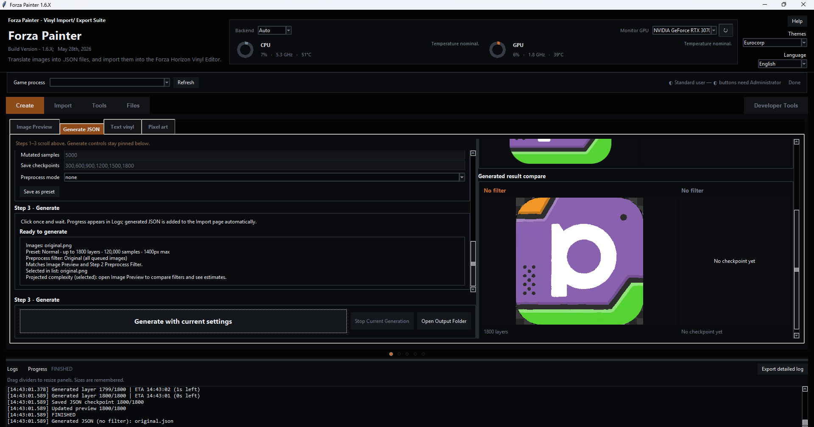
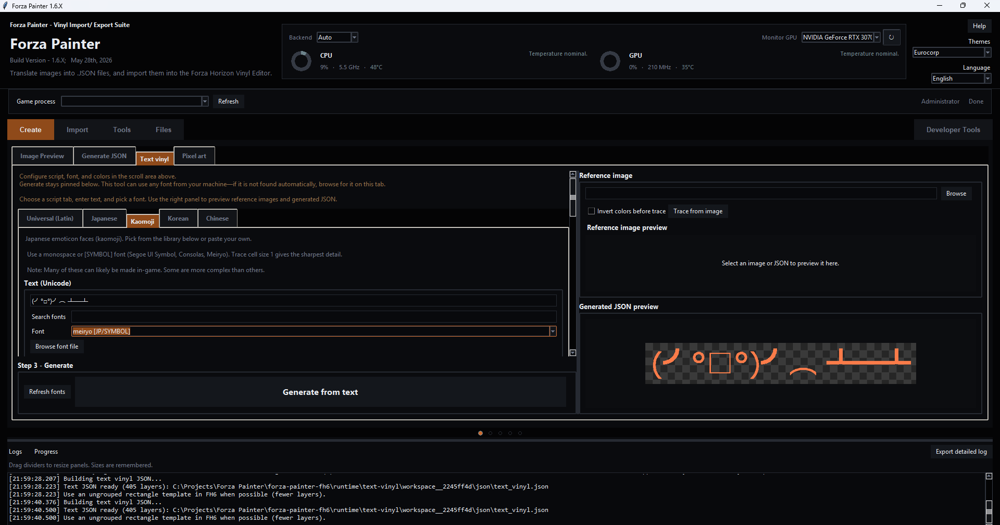
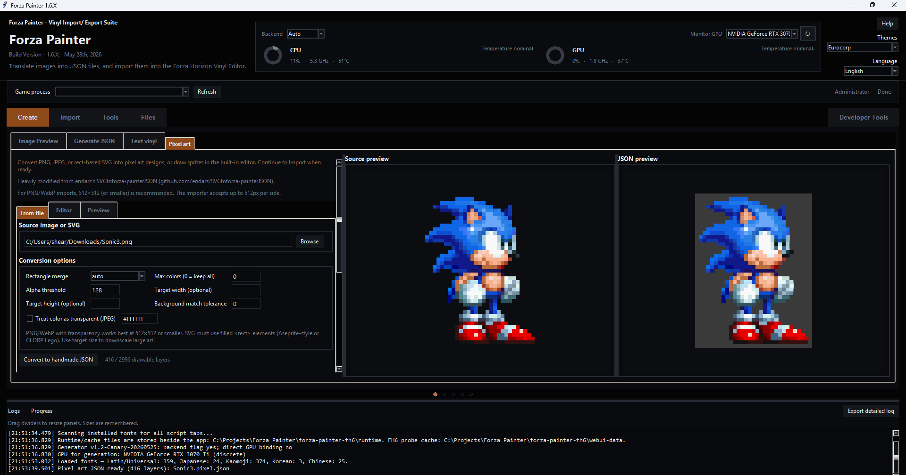
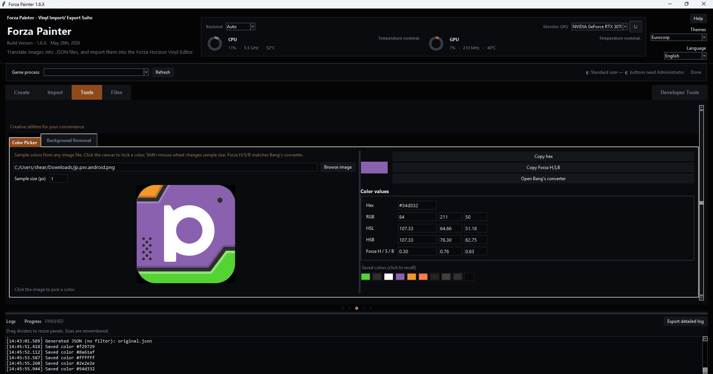

> **⚠️ 实验性分支**
>
> 本 Forza Painter 分支为实验性质，用作向[原版](https://github.com/bvzrays/forza-painter-fh6)提交潜在更新的试验平台。
>
> 虽然本版本功能完整，但可能出现不可预测的结果。若出于任何原因使用此版本，请谨慎操作。
>
>
> **官方 Forza Painter 工具**
>
> | 工具 | 链接 | 说明 |
> | --- | --- | --- |
> | **the_adawg 生成器** | [forza-painter](https://github.com/forza-painter/forza-painter) | 面向 Forza Horizon 4 与 5 的原始 Forza Painter。 |
> | **Bvzray 生成器** | [forza-painter-fh6](https://github.com/bvzrays/forza-painter-fh6) | 本工具的官方版本。**推荐日常使用。** |
> | **Kloudy 生成器** | [kloudys-forza-painter-suite](https://github.com/heyitshestia/kloudys-forza-painter-suite) · [NexusMods（备选）](https://www.nexusmods.com/forzahorizon6/mods/214) | 在 Forza Painter Discord 官方支持。包含完整贴膜编辑套件（类似游戏内编辑器）。 |

<h1 align="center">forza-painter FH6</h1>

  <strong>把图片转换成 Forza Horizon 6 Vinyl Group 的生成与导入工具。</strong>

  <a href="README.md">English</a> ·
  <a href="README.zh-CN.md">中文</a> ·
  <a href="README.ja-JP.md">日本語</a> ·
  <a href="README.ko-KR.md">한국어</a>

  <a href="README.md">README</a> ·
  <a href="FAQ.md">FAQ</a> ·
  <a href="ACKNOWLEDGEMENTS.md">Acknowledgements</a> ·
  <a href="CHANGELOG.md">Changelog</a> ·
  <a href="LICENSE">License</a>

  <code>v1.6.X（Beta）</code> · <code>Windows</code> · <code>Forza Horizon 6</code> · <code>GPU/OpenCL</code> · <code>单文件 EXE</code>

把 PNG/JPG/BMP 图片转换成 Forza Horizon 6 的 Vinyl Group 图层。软件内完成生成、预览和导入，普通用户不需要 Python、`.venv`、批处理文件，也不需要手动填写内存地址。

> **下载 EXE：** 从 [Releases](https://github.com/ShepherdHL/forza-painter-fh6/releases) 下载 `forza-painter-fh6-v1.6.X.exe`，直接运行。这是 ShepherdHL 分支的 **1.6.X Beta 版**。

> **画面发糊先看这里：** 优先提高 **随机样本（Random samples）**。数值在 **200000 以上** 通常会有明显质变；越高越清晰，但生成时间也更长。

> **导入可能需要等待：** 应用会依次尝试多套 FH6 模板定位逻辑，最长可能需要 5 分钟。请保持 FH6 停留在 Vinyl Group Editor，不要切换菜单。

| 功能 | 说明 |
| --- | --- |
| 生成 JSON | 使用内置 GPU/OpenCL 生成器把图片转换成 geometry JSON。 |
| 图像预览 | 生成前对比预处理滤镜（luma、双边、海报化、赛璐璐等）。 |
| 文字贴膜 | 使用 GB2312 字库与系统字体输入中文/CJK，或从参考图描摹。 |
| 导入 Final JSON | 导入本应用生成的 geometry JSON。 |
| 导入手工 JSON | 导入 FH6 类型码/手工 JSON（方形、圆形、三角形等）。 |
| 导出游戏 JSON | 将 FH6 中打开的贴膜组导出为手工 JSON。 |
| 安全写入 | 写入前自动定位并验证当前可编辑图层表。 |
| 自动更新 | 启动时检查新版本，发现更新时显示更新内容。 |

## 快速开始

1. 从 [Releases](https://github.com/ShepherdHL/forza-painter-fh6/releases) 下载 `forza-painter-fh6-v1.6.X.exe`。
2. 把 EXE 放在普通可写目录里，例如 `Desktop\forza-painter-fh6`。
3. 双击 EXE 启动。**导入或导出**时如需权限，应用会请求确认并可能弹出一次管理员（UAC）提示。
4. 在游戏里进入 `Create Vinyl Group` / `Vinyl Group Editor`，加载球形模板并 `Ungroup`。
5. 在软件 **Create** 页生成 JSON，再到 **Import → Import Final JSON**，填写游戏里显示的**真实模板层数**后导入。点击标题栏 **Help** 可查看教程与安全说明。

不要下载 GitHub 自动生成的 `Source code` ZIP，除非你要开发项目。普通用户只需要 `.exe`。

## 功能概览

桌面应用中各主要工作区。

<table>
  <tr>
    <td align="center" width="50%">
       
      <strong>图像预览</strong> 
      生成前对比预处理滤镜（luma、双边、海报化、赛璐璐等）。
    </td>
    <td align="center" width="50%">
       
      <strong>生成 JSON</strong> 
      排队图片、选择品质，并运行 GPU 生成器。
    </td>
  </tr>
  <tr>
    <td align="center" width="50%">
       
      <strong>文字贴膜</strong> 
      使用 GB2312 字库与系统字体输入中文/CJK，或从参考图描摹。
    </td>
    <td align="center" width="50%">
       
      <strong>像素艺术</strong> 
      将图片转为 FH6 形状图层，或使用内置编辑器绘制。
    </td>
  </tr>
  <tr>
    <td align="center" colspan="2">
       
      <strong>工具 → 取色器</strong> 
      从图片取样并转换为 Forza H/S/B 色值。
    </td>
  </tr>
</table>

## 品质预设（摘要）

| 预设 | 层数 | 随机样本 | 说明 |
| --- | ---: | ---: | --- |
| 0. Tailored（实验） | 按图片 | 按图片 | 可选；由图像预览分析生成。**Normal（4）为默认。** |
| 1. Eco（实验） | 1500 | 90000 | 更低 GPU 负载 |
| 4. Normal | 1800 | 120000 | 推荐默认 |
| 7. Maximum Power | 2900 | 1000000 | 最高质量，最慢 |

完整预设表、生成/导入流程、故障排除与安全说明：**[FAQ.md](FAQ.md)**（英文）

## 更多文档

| 文档 | 内容 |
| --- | --- |
| [FAQ.md](FAQ.md) | 工作流程、规则、故障排除、安全 FAQ（英文） |
| [ACKNOWLEDGEMENTS.md](ACKNOWLEDGEMENTS.md) | 致谢与上游项目 |
| [CHANGELOG.md](CHANGELOG.md) | 版本历史（应用内更新也会读取） |
| [SECURITY.md](SECURITY.md) | 安全策略 |
| [docs/SAFETY.md](docs/SAFETY.md) | 内存访问与信任说明 |
| [docs/SAFETY.zh-CN.md](docs/SAFETY.zh-CN.md) | 安全说明（中文） |
| [docs/TEXT_VINYL.md](docs/TEXT_VINYL.md) | 文字贴膜参考 |
