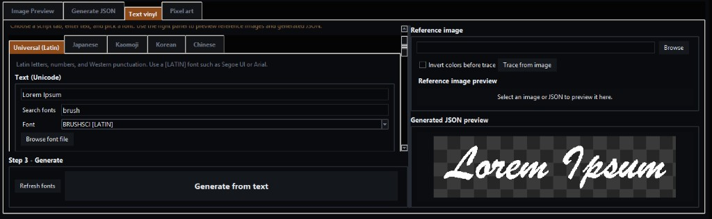
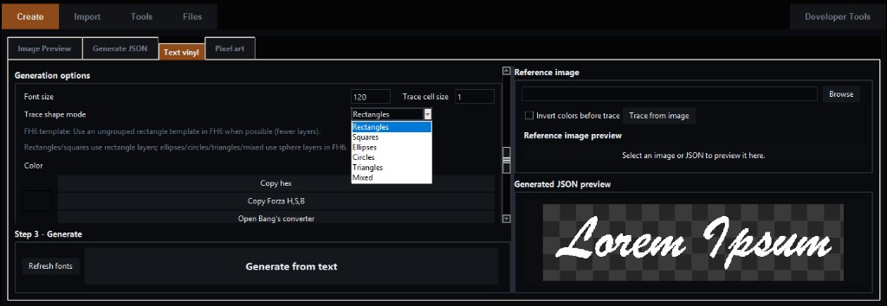
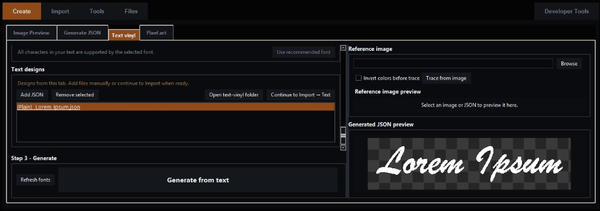
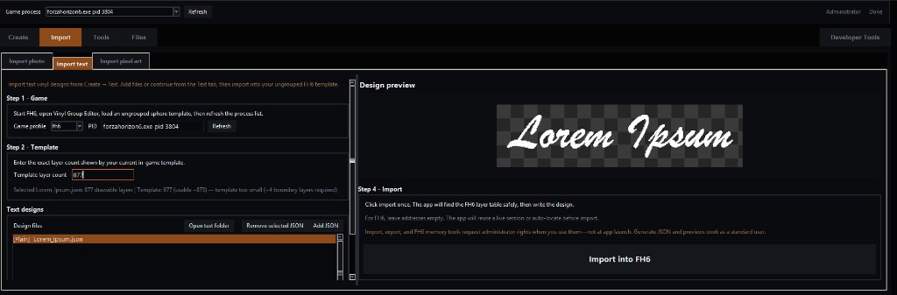
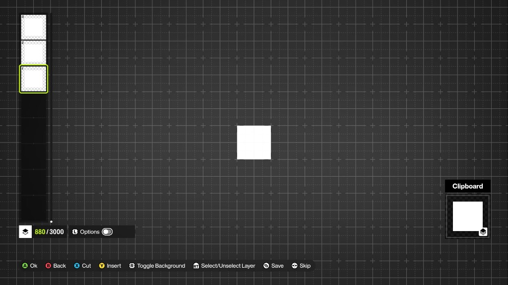
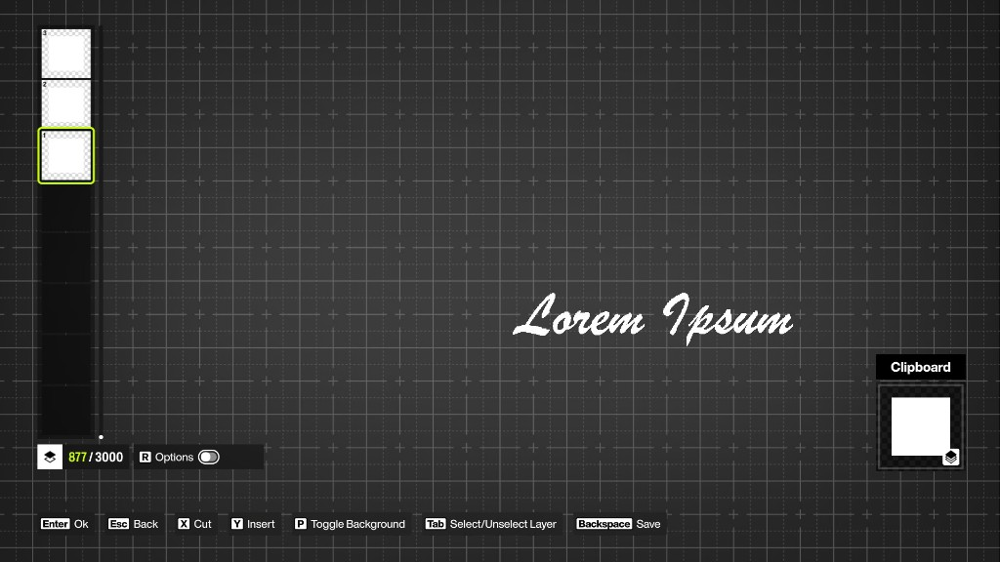
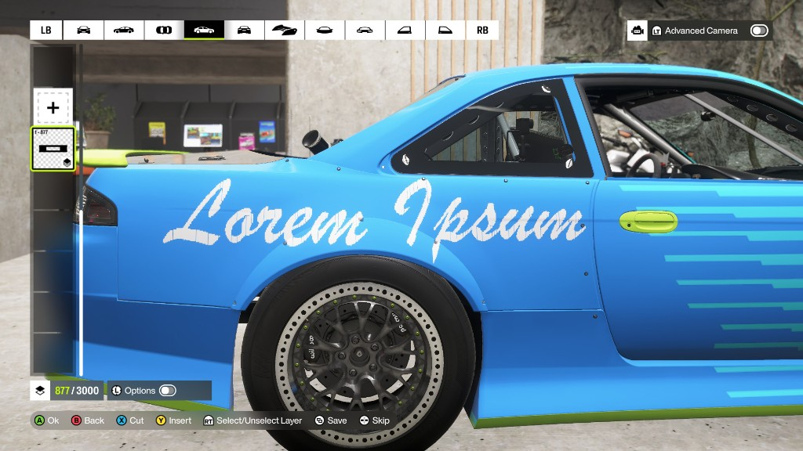

# Text vinyl — step-by-step guide

This walkthrough shows how to turn typed text (or a traced image) into vinyl layers in **Forza Horizon 5** or **Forza Horizon 6** using **Forza Painter**. Screenshots follow the numbered filenames in `docs/images/text-vinyl/`.

For CJK scripts, kaomoji, command-line usage, and shape-mode details, see [TEXT_VINYL.md](TEXT_VINYL.md).

---

## What you need

- **Forza Painter** running on Windows.
- **FH5 or FH6** with the **Vinyl Group Editor** open on an **ungrouped** template that has **enough layers** for your design (see [Step 5](#step-5-prepare-an-in-game-template)).
- For **Import**, run the game and Painter **as Administrator** when prompted (memory write). **Create → Text vinyl** (generate and preview) works as a normal user.

---

## Quick overview

| Step | Where | What you do |
|------|--------|-------------|
| [1](#step-1-open-text-vinyl-and-enter-your-text) | Create → Text vinyl | Choose script tab, type text, pick a font |
| [2](#step-2-set-generation-options) | Create → Text vinyl | Font size, trace cell size, shape mode, color |
| [3](#step-3-generate-and-review) | Create → Text vinyl | Generate JSON, check preview and design list |
| [4](#step-4-import-into-the-game) | Import → Import text | Connect to game, set template layer count, import |
| [5](#step-5-prepare-an-in-game-template) | In-game Vinyl Group Editor | Load ungrouped template with enough layers |
| [6](#step-6-save-and-reload-in-the-editor) | In-game Vinyl Group Editor | Confirm layers after import |
| [7](#step-7-place-the-vinyl-on-your-car) | Livery editor | Apply the vinyl group to the car |

**Tip:** Do **Step 5** in-game *before* **Step 4** if you are setting up a new template. Steps 1–3 only need the app.

---

## Step 1 — Open Text vinyl and enter your text

1. Open **Create** → **Text vinyl**.
2. Pick the script tab that matches your text (this example uses **Universal (Latin)**).
3. Type your text in **Text (Unicode)** (example: `Lorem Ipsum`).
4. Use **Search fonts** to filter the list, then choose a font tagged for your script (example: **BRUSHSCI [LATIN]**).
5. Optional: **Browse font file** for any `.ttf` / `.otf` / `.ttc` on your PC.
6. Check the coverage line under the font controls — it should say all characters are supported.

---

## Step 2 — Set generation options

Scroll to **Generation options** on the left (or use the layout shown below).

| Setting | What it does |
|---------|----------------|
| **Font size** | How large glyphs are rasterized before tracing (example: `120`). |
| **Trace cell size** | Grid step for tracing (`1` = sharpest, most layers; higher = blockier, fewer layers). |
| **Trace shape mode** | Which FH vinyl primitives build the letters (rectangles, squares, ellipses, circles, triangles, mixed). |
| **Color** | Fill color for generated shapes; use **Copy hex** or **Copy Forza H,S,B** if you match in-game paint. |

**FH6 template note** (shown in the app):

- Prefer an **ungrouped rectangle** template when using **Rectangles** or **Squares** (fewer layers).
- **Ellipses**, **Circles**, **Triangles**, and **Mixed** use **sphere** layers in FH6 — use a matching ungrouped sphere template.

---

## Step 3 — Generate and review

1. Click **Generate from text** (**Step 3 — Generate**).
2. Watch **Generated JSON preview** on the right — it should match your wording and style.
3. Your design appears under **Text designs** (example: `[Plain] Lorem Ipsum.json`).
4. Optional: **Add JSON** / **Remove selected** to manage files; **Open text-vinyl folder** opens the workspace on disk.
5. When satisfied, click **Continue to Import → Text** to open **Import → Import text** with this design selected.

**Optional — trace from an image instead of a font**

1. Under **Reference image**, **Browse** to a high-contrast PNG.
2. Match **Trace shape mode** to what you will use in-game.
3. Enable **Invert colors before trace** if letters are light on a dark background.
4. Click **Trace from image**, then preview the result the same way.

---

## Step 4 — Import into the game

1. Start **FH5** or **FH6**, open **Vinyl Group Editor**, and load your **ungrouped** template ([Step 5](#step-5-prepare-an-in-game-template)).
2. In Painter, open **Import** → **Import text** (or arrive via **Continue to Import → Text**).
3. **Step 1 — Game:** Choose the correct **Game profile** (FH5 / FH6), select the running process, and **Refresh** if needed.
4. **Step 2 — Template:** Enter the **exact** layer count shown in-game (bottom of the layer stack, e.g. `877 / 3000` → enter `877`).
5. Select your JSON in **Text designs** and confirm **Design preview**.
6. Read the status line under the layer count — it compares drawable layers in the JSON to your template (FH reserves about **4 boundary layers**).
   - Example warning: *template too small (~4 boundary layers required)* — use a larger ungrouped template or regenerate with a higher **trace cell size** / simpler **shape mode**.
7. **Step 4 — Import:** Click **Import into FH5** / **Import into FH6** once. Leave memory addresses empty for FH6 unless you know you need them; the app locates the live layer table when possible.

---

## Step 5 — Prepare an in-game template

Before importing (or when starting a new design):

1. In the **Vinyl Group Editor**, create or open an **ungrouped** group.
2. Use a **rectangle** or **square** stack if you generated with **Rectangles** / **Squares**; use a **sphere** stack for ellipse/circle/triangle modes in FH6.
3. Build enough **empty placeholder layers** so the count meets or exceeds your JSON (+ boundary layers). The counter shows something like **880 / 3000** — that number is what you type in Painter’s **Template layer count**.

---

## Step 6 — Save and reload in the editor

After a successful import:

1. **Save** the vinyl group in-game (**Menu** / save prompt per platform).
2. **Reload** or re-open the group so FH redraws every layer with the correct shapes.
3. In the layer sidebar you should see a tall stack (example: **877** layers) forming your text.

If shapes look wrong or like plain squares only, save/reload again and confirm your template type matches **Trace shape mode**.

---

## Step 7 — Place the vinyl on your car

1. Leave the Vinyl Group Editor and open the **livery** / **decals** flow for your car.
2. Add or paste your saved **vinyl group** onto a side (or wrap as you prefer).
3. Scale, move, and rotate like any other vinyl. Complex text is made of hundreds of small shapes — zoom in if you need to tweak individual areas.

---

## Troubleshooting

| Problem | Try this |
|---------|----------|
| “Template too small” | Increase in-game layer count, or regenerate with higher **trace cell size** or **rectangles** mode. |
| Import can’t find the game | Run Painter as Administrator; refresh process list; keep Vinyl Group Editor open on the template. |
| Missing or tofu characters | Pick a font tagged for your script ([LATIN], [JP], [KR], etc.) or **Browse font file** with better coverage. |
| Wrong colors in-game | Copy H,S,B from **Generation options** and set the same values on vinyl layers in FH. |
| Blurry or too many layers | Lower **font size** or raise **trace cell size**; use **rectangles** for fewer layers. |

---

## Related docs

- [TEXT_VINYL.md](TEXT_VINYL.md) — scripts (Japanese, Korean, Chinese, kaomoji), shape modes, CLI, tips
- [SAFETY.md](SAFETY.md) — administrator rights and memory safety
